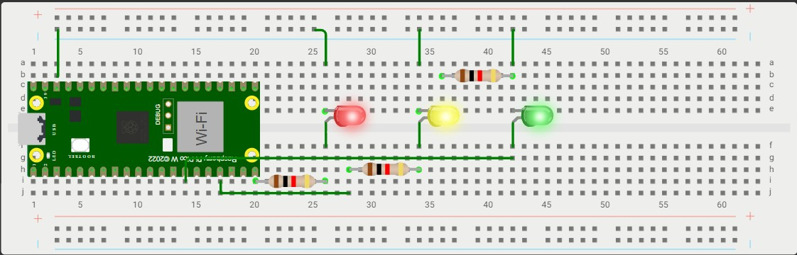
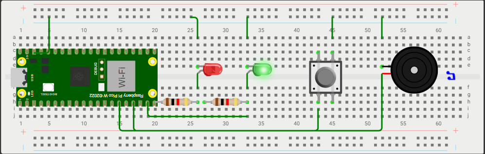
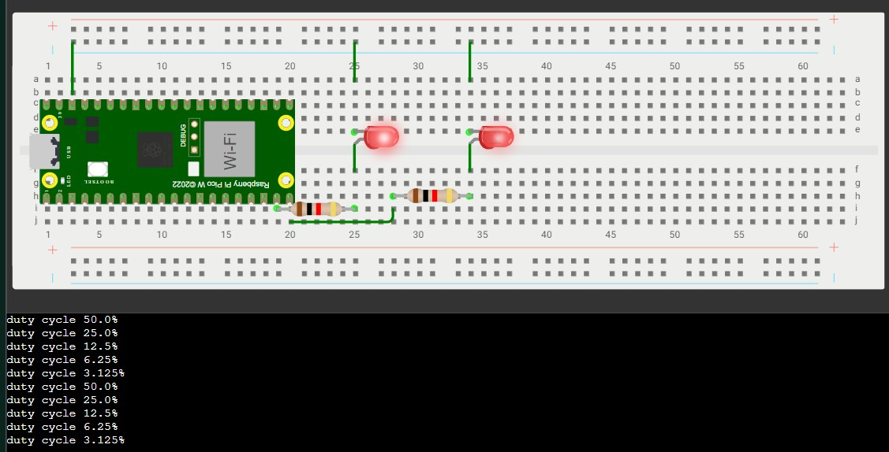
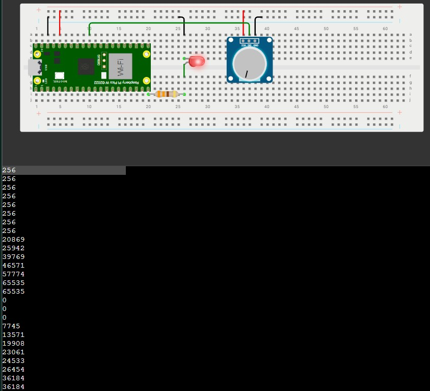
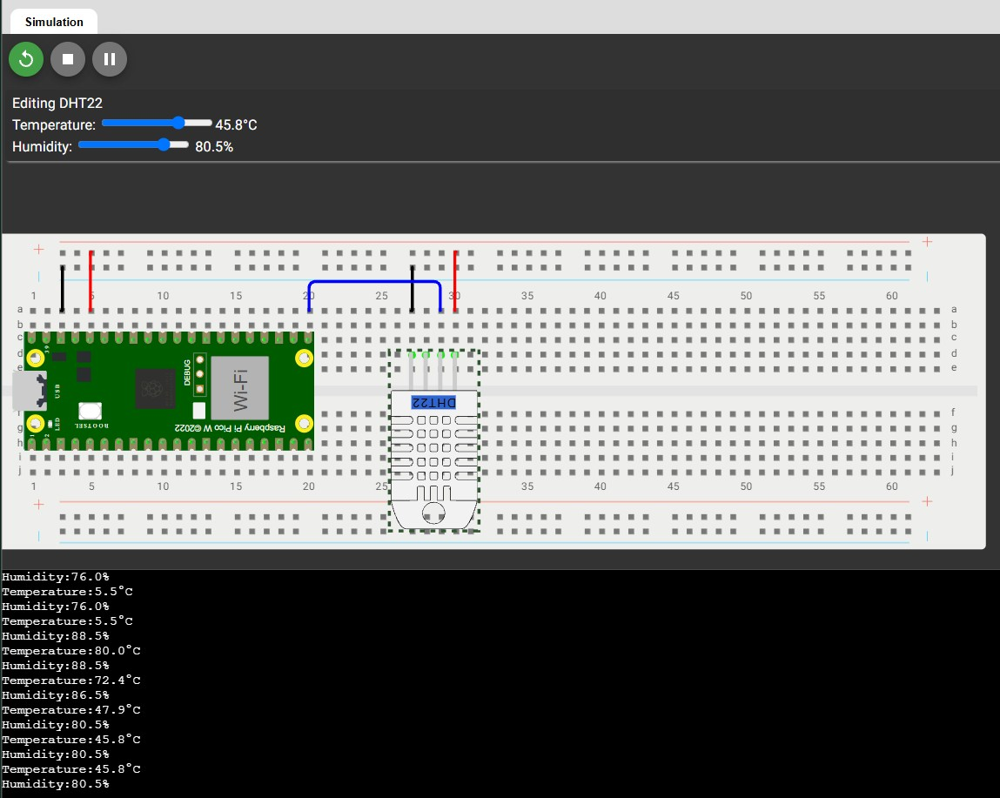

# Edge Computing with Raspberry Pi Pico WH

Hands-on laboratory exercises and foundational edge computing workflows using the **Raspberry Pi Pico WH** running **MicroPython**.

---

## 🛠️ Hardware Specifications

| Component | Specification |
| :--- | :--- |
| **Model** | Raspberry Pi Pico WH (with pre-soldered pin headers) |
| **Silicon / MCU** | Raspberry Pi **RP2040** (Dual-core ARM Cortex-M0+ @ 133 MHz) |
| **Memory** | 264 KB on-chip SRAM, 2 MB external onboard QSPI Flash |
| **Wireless Module** | Infineon **CYW43439** (2.4 GHz 802.11n Wi-Fi & Bluetooth 5.2) |
| **I/O & Development** | 26 multi-function GPIO pins, 3-pin SWD debug port, micro-USB |

---

## 📂 Repository Structure

```
edge_computing/
├── .vscode/
├── 00_setup_internal_led/
│   └── main.py
├── 01_led/
│   ├── main.py
│   └── traffic_light.jpg
├── 03_hardware_fundamentals/
│   ├── main.py
│   ├── nokia.py
│   └── pedestrian_light.jpg
├── 04_analog_digital_signals/
│   ├── main.py
│   ├── wokwi_pwm_simulation.jpg
│   └── led_dimmer.jpg
├── 05_sensors/
│   └── dht22_temperature_humidity_sensor
│       ├── main.py
│       └── dht22.jpg
├── 06_wifi/
│   ├── main.py
│   ├── wifi_credentials.json
│   └── wifi.py
├── .gitignore
└── README.md
```
---

## 🧪 Labs & Progress

### `00_setup_internal_led` Onboard LED Verification

Verifies the MicroPython runtime environment and board-level communication by driving the onboard status LED.

**Key Concepts:**

- Pin Mapping: On the standard Pico, the onboard LED is hardwired to GPIO 25, but on the Pico W / WH it is wired through the Infineon CYW43439 wireless IC. MicroPython automatically abstracts this via `Pin("LED", Pin.OUT)`

- State Inversion: Uses `.toggle()`to invert the LED state without tracking high (1) and low (0) values manually.

### `01_led` External Multi-LED Traffic Light Cycle

Interfaces external components via a breadboard, driving multiple color-coded LEDs sequentially through dedicated GPIO pins.

**Wiring & Wokwi Simulation:**

> 💡 **New to Wokwi?** [Wokwi](https://wokwi.com/) is a free online electronics simulator. It allows you to build, wire, and test code for microcontrollers (like the Raspberry Pi Pico) directly in your web browser without needing to buy any physical hardware!



> **Note:** The Wokwi simulation image above shows all three LEDs illuminated at once to demonstrate a fully working circuit. It is crucial to ensure all jumper wires and resistors are plugged into the exact right places for the circuit to succeed. In reality, the provided `main.py` script cycles through the lights one at a time (like a traffic light). However, once you have everything wired correctly, you can modify the code and let your imagination decide how to light them up!

**Hardware Pin Mapping**
- Red LED: GPIO 15 (Pin 20) $\rightarrow$ Current-limiting resistor $\rightarrow$ Ground
- Yellow LED: GPIO 13 (Pin 17) $\rightarrow$ Current-limiting resistor $\rightarrow$ Ground
- Green LED: GPIO 10 (Pin 14) $\rightarrow$ Current-limiting resistor $\rightarrow$ Ground

**Implementation Details**

- Organizes hardware pin objects inside a Python dictionary for structured access.
- Uses list comprehension to isolate and shut off non-active LEDs during each phase of the cycle.


###  03_hardware_fundamentals

This project is a hardware simulation of a pedestrian crossing light built in MicroPython. It features a cross-request button, standard Red/Green walk lights, and an audible buzzer signal to assist visually impaired pedestrians.

**📸 Simulation Preview**


*The pedestrian crossing system in the active "Walk" phase. The green LED is illuminated and the buzzer is emitting the audible crossing signal.*

**🛠️ Hardware Setup (Pin Mapping)**

| Component        | GPIO Pin | Role                          | Configuration                                 |
| ---------------- | -------- | ----------------------------- | --------------------------------------------- |
| **Red LED**      | 15       | "Do Not Walk" Signal          | Output (wired with current-limiting resistor) |
| **Green LED**    | 14       | "Walk" Signal                 | Output (wired with current-limiting resistor) |
| **Push Button**  | 13       | Pedestrian Cross Request      | Input (Internal `PULL_UP`)                    |
| **Buzzer**       | 11       | Audible Crossing Signal       | Output                                        |

**✨ System Features**
* **Hardware Interrupts:** Uses `Pin.irq` for immediate cross-request registration without blocking the main traffic loop.
* **Debouncing Logic:** Software debounce implemented using `time.ticks_ms()` to prevent rapid, ghost button presses.
* **Audible Accessibility:** Integrated buzzer sequence mimics real-world accessibility features for pedestrian crossings.
* **Clearance Warning:** Flashing green sequence indicates the crossing phase is about to terminate.

#### 🎵 Experimental Extension: `nokia.py`

An experimental variation located in this folder replaces the standard buzzer crossing beep with the classic **Nokia ringtone** melody using PWM tone generation.

- **PWM Frequency Modulation:** Uses `buzzer.freq(frequency)` mapped across specific note frequencies (e.g., E5 at 659 Hz, D5 at 587 Hz) combined with precise note durations and pauses.
- **Wokwi Audio Simulation:** In the Wokwi simulator, the passive buzzer model generates real synthesized audio in your web browser, allowing you to hear the Nokia tune play in real time when pressing the cross-request button.
- **Execution & Boot Note:** This script was created as an experimental audio test. MicroPython exclusively executes `main.py` automatically upon powering on or resetting the Raspberry Pi Pico. To run this experiment on hardware on boot (or in Wokwi's default root runner), either rename `nokia.py` to `main.py` or execute the file directly from VS Code via the MicroPico extension.


### 04_analog_digital_signals and Duty Cycle Fading

This project demonstrates the fundamental differences between a standard digital signal and an analog-like Pulse Width Modulation (PWM) signal. It visually compares a constant reference LED against a PWM-driven LED that progressively halves its brightness.


**📸 Simulation Preview**



*Wokwi simulation displaying the console output as the PWM duty cycle is progressively halved, resulting in a dimming effect on the left LED.*

**🛠️ Hardware Setup (Pin Mapping)**

| Component | GPIO Pin | Role | Configuration |
| :--- | :--- | :--- | :--- |
| **Fading LED** | 15 | PWM Output (Variable brightness) | `PWM()` operating at `1000 Hz` |
| **Reference LED**| 14 | Digital Output (Constant brightness) | `Pin.OUT` driven `HIGH (1)` |

**✨ Key Concepts & Implementation**

- **16-Bit Resolution:** MicroPython handles PWM duty cycles using 16-bit integers (`2**16`), meaning the power level is represented by a value between `0` (off) and `65535` (fully on).
- **Pulse Width Modulation (PWM):** Instead of a true analog voltage, the microcontroller rapidly pulses the digital pin on and off 1,000 times per second (`freq(1000)`) to create the illusion of dimming.
- **Algorithmic Fading:** The main loop utilizes a multiplier to perfectly cut the duty cycle in half on each step, dropping the visual brightness in a precise sequence: 50% ➔ 25% ➔ 12.5% ➔ 6.25% ➔ 3.125% before resetting.

### led_dimmer_potentiometer (ADC to PWM Control)

This sub-project demonstrates continuous analog input reading using the Raspberry Pi Pico's Analog-to-Digital Converter (ADC) and mapping that input directly to a PWM-controlled LED for real-time manual brightness adjustment.

**📸 Simulation Preview**



*Wokwi simulation displaying real-time ADC readings in the console and dynamic LED brightness adjustment as the potentiometer knob turns.*

**🛠️ Hardware Setup (Pin Mapping)**

| Component | GPIO Pin | Role | Configuration |
| :--- | :--- | :--- | :--- |
| **Potentiometer (Wiper)** | 26 (ADC0) | Analog Input | `ADC(Pin(26))` |
| **Dimmer LED** | 15 | PWM Output (Variable brightness) | `PWM()` operating at `1000 Hz` |

**✨ Key Concepts & Implementation**

- **Analog-to-Digital Conversion (ADC):** Reads the variable voltage (0–3.3V) from the potentiometer's wiper and converts it into a 16-bit integer value (`0` to `65535`) using `potentiometer.read_u16()`.
- **Direct 16-Bit Mapping:** Because both `read_u16()` and `duty_u16()` operate within the same range (`0`–`65535`), the raw sensor reading directly controls the PWM duty cycle with zero math conversion required.
- **Continuous Sampling:** The polling loop updates every 100ms (`time.sleep(0.1)`), providing smooth visual feedback while keeping USB serial monitoring responsive.
- **Console Feedback:** The terminal output in the simulation displays the real-time 16-bit integer values being read by the ADC. As the potentiometer knob is turned, you can see the value dynamically scale from 0 (knob turned all the way down, LED off) up to 65535 (knob turned all the way up, LED fully bright).

### `05_sensors` Temperature & Humidity Sensor (DHT11 / DHT22)

This lab reads ambient temperature and relative humidity using a digital DHT sensor connected via GPIO 16.

**📸 Simulation Preview**



#### Simulation vs. Physical Hardware Note
* **Wokwi Simulation (DHT22):** In the simulation, the **DHT22** module is used because Wokwi does not provide a native DHT11 component.
* **Physical Hardware (DHT11):** On the actual Raspberry Pi Pico setup, we use the **DHT11** sensor:
  * **Hardware Compatibility:** The physical lab kit contains the DHT11 module.
  * **Code Switch:** In MicroPython, the interface is identical—simply change `from dht import DHT22` to `from dht import DHT11`, and instantiate `sensor = DHT11(Pin(16))`.
  * **Differences:** DHT11 is optimized for basic indoor ranges (0–50°C, 20–80% RH with integer precision), whereas DHT22 supports wider ranges and decimal precision (-40–80°C, 0–100% RH).

  **🛠️ Hardware Setup (Pin Mapping)**

| Component | Pin / GPIO | Role | Configuration |
| :--- | :--- | :--- | :--- |
| **DHT11 / DHT22 VCC** | 3V3 (Pin 36) | Power Supply (3.3V) | Power rail |
| **DHT11 / DHT22 GND** | GND (Pin 38) | Ground | Ground rail |
| **DHT11 / DHT22 Data** | GP16 (Pin 21) | Digital Signal I/O | `Pin(16)` |

 **Documentation & References :**

  [MicroPython dht Module Documentation](https://docs.micropython.org/en/latest/esp8266/tutorial/dht.html)


  [Wokwi DHT22 Guide & Reference](https://docs.wokwi.com/parts/wokwi-dht22)

### `06_wifi` Network Connectivity & Credential Management

This project establishes a wireless local area network (WLAN) connection using the Raspberry Pi Pico W's onboard Infineon CYW43439 Wi-Fi chip. It demonstrates secure credential management and provides physical visual feedback upon a successful network connection.

**🛠️ Hardware Setup (Pin Mapping)**

| Component | GPIO Pin | Role | Configuration |
| :--- | :--- | :--- | :--- |
| **Status LED** | 15 | Network Status Indicator | `Pin.OUT` driven `HIGH (1)` on connect |

**✨ Key Concepts & Implementation**

- **WLAN Configuration:** Utilizes the `network.WLAN(network.STA_IF)` module to configure the microcontroller as a standard Wi-Fi client (Station interface).
- **Regional Compliance:** Sets the regulatory wireless domain using `rp2.country("SE")` to comply with local Swedish radio frequency regulations.
- **Secure Secrets Management:** Demonstrates IoT security best practices by loading the SSID and password from an external `wifi_credentials.json` file. The actual credentials are safely excluded from version control via `.gitignore`, while a `wifi_credentials_example.json` file serves as a safe template for repository users.
- **Connection Polling:** Implements a timeout-based `while` loop that periodically checks `wlan.isconnected()`, preventing the microcontroller from hanging indefinitely if the network is unavailable.


## 🚀 Environment & Setup
1. Firmware: Flash the latest MicroPython for Raspberry Pi Pico W `.uf2` binary onto the board using `BOOTSEL` mode.

2. VS Code Setup: Use the MicroPico extension to manage the serial connection, upload files, and interact via REPL.

3. Execution: Save standalone scripts as main.py directly to the device root to trigger execution on boot.